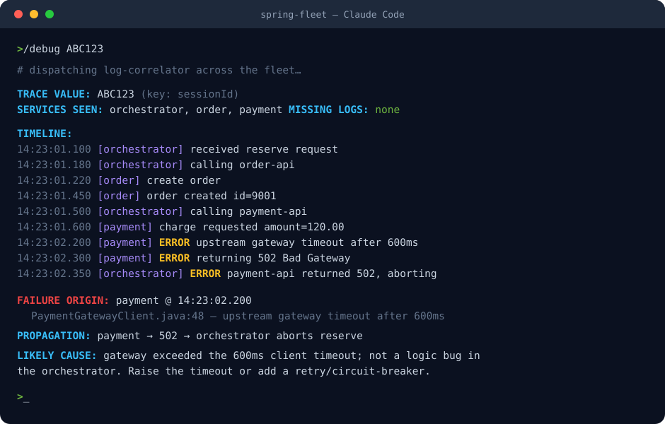

<p align="center">
  
</p>

<p align="center">
  <a href="LICENSE"></a>
  
  
  
  
  
</p>

# spring-fleet

A [Claude Code](https://claude.com/claude-code) plugin for navigating, tracing,
and debugging a **fleet of multi-repo Spring Boot microservices**.

It does two things well:

- **🔍 Trace** — follow a request or feature across many service repos and shared
  libraries, with `file:line` citations, including inter-service (proxy-lib) hops.
- **🐞 Debug** — when a local dev run breaks, correlate logs across every service
  by a trace key (`sessionId`, `requestId`…), reconstruct one cross-service
  timeline, find the failing hop, and map it back to source.

The plugin is **generic**. Everything specific to *your* environment — repo
paths, ports, service names, trace keys — lives in one private config file that
is **git-ignored and never committed**.

## `/debug` in action

One trace key, every service's logs merged into a single timeline, the failing
hop isolated and explained — across repos:

<p align="center">
  
</p>

> The output above is the real correlator running against the bundled
> [`fixtures/`](fixtures/) fleet — reproduce it with the [demo command](#try-the-demo-no-setup).

---

## How it works

```
spring-fleet (this plugin — generic, shareable)   your machine (private)
├── commands/   /fleet-init /trace /debug /logs    spring-fleet.config.json
├── skills/     the know-how                         ├─ reposRoot, buildTool
├── agents/     fleet-explorer, log-correlator       ├─ services[] (name,port,path)
├── scripts/    correlate_logs / scan_repos / tail   ├─ sharedLibs[], proxyLib
└── logback/    drop-in logging convention           ├─ topology (the call chain)
                                                      ├─ traceKeys ["sessionId"]
                                                      └─ logDir
```

The plugin reads your config at runtime — no paths, ports, or names are ever
hard-coded into the plugin itself.

## Requirements

- [Claude Code](https://claude.com/claude-code)
- Python 3.8+ (standard library only — no third-party packages)
- A fleet of Spring Boot services built with Gradle or Maven

## Install

```
/plugin marketplace add talayash/spring-fleet
/plugin install spring-fleet
```

## Quickstart

1. **Generate your config** (scans your repos, infers ports/context paths,
   detects services vs shared libs):
   ```
   /fleet-init C:/path/to/your/repos
   ```
   Confirm the two things it can't infer — your `traceKeys` and the `topology`
   (who calls whom). The result is written to `spring-fleet.config.json` in your
   project root.

2. **Make sure logs land somewhere stable** (only if they're console-only or
   scattered): the `spring-fleet-logging-setup` skill installs a logback
   convention so every service writes `<logDir>/<service>.log` with your trace
   keys in the pattern.

3. **Use it:**
   ```
   /trace POST /order-v1/reserve
   /debug ABC123                 # a sessionId from a failed request
   /debug "NullPointerException at PaymentController.charge"
   /logs payment --grep ERROR --follow
   ```

## Commands

| Command | What it does |
|---|---|
| `/fleet-init [reposRoot]` | Scan repos → generate/update `spring-fleet.config.json` |
| `/trace <endpoint\|feature>` | Cross-repo call chain with `file:line` citations |
| `/debug <traceValue \| error>` | Cross-service log timeline → failure origin → fix |
| `/logs [service\|all] [--grep --lines --follow]` | Tail/aggregate fleet logs |

## Configuration

Copy `spring-fleet.config.example.json` to `spring-fleet.config.json` and edit,
or let `/fleet-init` generate it. The schema is documented in
`spring-fleet.config.schema.json`. Key fields:

- `reposRoot` — directory containing all your repos
- `services[]` — `{ name, path, port, contextPath, logFile }`
- `sharedLibs[]`, `proxyLib` — for cross-repo tracing
- `topology` — `entry` services and `[from, to]` call edges
- `traceKeys` — MDC keys that correlate a request (e.g. `["sessionId"]`)
- `logDir` — where per-service logs are collected

> **⚠️ Privacy:** your real `spring-fleet.config.json` contains private paths,
> ports, and service names. It is `.gitignore`d by default. **Never commit it.**
> Share the example file, not your config.

## Try the demo (no setup)

The repo ships a tiny fake fleet under `fixtures/`:

```
python scripts/correlate_logs.py --config fixtures/fleet.config.json --value ABC123
```

You'll see a three-service timeline reconstruct a failed reserve, with the
payment gateway timeout surfaced as the root cause.

## Development

```
python -m unittest discover -s tests -v
```

Tests run the deterministic scripts against the `fixtures/` fleet — no network,
no third-party deps.

## Roadmap

- `/run` — launch services and tee stdout to `logDir` (for services you can't
  reconfigure)
- `/impact <symbol|file>` — find every consumer of shared-lib code across the fleet
- Optional SessionStart hook to load fleet topology into context automatically

See [CHANGELOG.md](CHANGELOG.md) for release history.

## License

MIT © Tal Ayash
